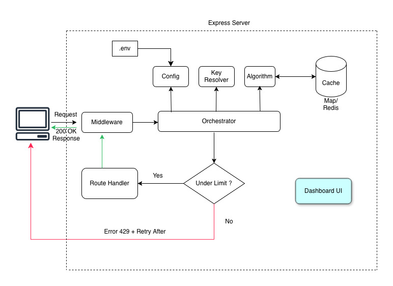

# Rate Limiter

A configurable rate limiter built in TypeScript using the **Sliding Window Counter** algorithm. Features per-endpoint limits, composable key strategies, environment-driven configuration, and a real-time dashboard.


## Demo


https://github.com/user-attachments/assets/e711d479-84eb-49ce-94f1-9ae25f1cd27a


---

## Architecture

Each layer has a single responsibility and can be replaced independently.


---
## Documentation

| Document | Description |
|----------|-------------|
| [Algorithm Deep Dive](docs/algorithm.md) | Sliding Window Counter explained with comparisons |
| [Configuration Guide](docs/configuration.md) | Environment variables, per-endpoint overrides, key strategies |
| [API Reference](docs/api-reference.md) | Endpoints, response headers, and response formats |


---

## How It Works

The **Sliding Window Counter** blends counts from the current and previous time windows:

```
|----prev window----|----current window----|
                          ↑ 70% through

weight = 1 - (elapsed / windowSize) = 0.30
estimatedCount = prevCount × 0.30 + currentCount
```

This avoids the burst-at-boundary problem of fixed windows, using only O(1) memory per key.

---

## Project Structure

```
rate-limiter/
├── src/
│   ├── types.ts
│   ├── config.ts
│   ├── keyResolver.ts
│   ├── slidingWindow.ts
│   ├── rateLimiter.ts
│   ├── middleware.ts
│   └── index.ts
├── dashboard/
│   └── index.html
├── docs/
│   ├── algorithm.md
│   ├── configuration.md
│   └── api-reference.md
├── .env
├── .gitignore
├── package.json
└── tsconfig.json
```

```
| File | Responsibility |
|------|---------------|
| `src/types.ts` | All interfaces and type contracts |
| `src/config.ts` | Reads `.env`, resolves per-endpoint limits |
| `src/keyResolver.ts` | Builds composite keys from request context |
| `src/slidingWindow.ts` | Sliding Window Counter algorithm + stale key cleanup |
| `src/rateLimiter.ts` | Orchestrator — ties config + key + algorithm |
| `src/middleware.ts` | Express middleware, HTTP headers, 429 responses |
| `src/index.ts` | Express server, demo routes, dashboard API |
| `dashboard/index.html` | Single-file React dashboard (no build step) |

> Swap the algorithm? Replace `slidingWindow.ts`. Change key logic? Replace `keyResolver.ts`. Add Redis? Replace the `Map` in `slidingWindow.ts`. One file per concern.
---

## Quick Start

```bash
# 1. Install dependencies
npm install

# 2. Set up environment variables
cp .env.example .env

# 3. Run in development mode
npm run dev

# Dashboard: http://localhost:3000/index.html
```
---

## Configuration

All settings via environment variables in `.env`:

```bash
RATE_LIMIT_DEFAULT=100              # Default limit for all endpoints
RATE_LIMIT_WINDOW_MS=60000          # Window duration (60s)
RATE_LIMIT_KEY_STRATEGY=userId,endpoint  # How to identify callers

# Per-endpoint overrides
RATE_LIMIT_POST_LOGIN=10
RATE_LIMIT_POST_SIGNUP=5
RATE_LIMIT_GET_SEARCH=50
```

Change the default to 1000? Edit one line: `RATE_LIMIT_DEFAULT=1000`. No code changes.

---

## Key Strategies

| Strategy | Key Example | Use Case |
|----------|-------------|----------|
| `ip` | `192.168.1.1` | IP-based limiting |
| `userId` | `user_alice` | Per-user limiting |
| `apiKey` | `sk-abc123` | Per-API-key limiting |
| `userId,endpoint` | `user_alice\|POST:/api/login` | Per-user per-endpoint |

Each unique key gets its own independent rate limit window.

---

## API Endpoints

| Method | Path | Limit |
|--------|------|-------|
| POST | `/api/login` | 10/min |
| POST | `/api/signup` | 5/min |
| GET | `/api/search` | 50/min |
| GET | `/api/data` | 100/min (default) |
| GET | `/api/settings` | 100/min (default) |

### Response Headers (every request)

```
X-RateLimit-Limit: 100
X-RateLimit-Remaining: 73
X-RateLimit-Reset: 1710600060000
Retry-After: 43                  ← only on 429
```

### 429 Response

```json
{
  "error": "Rate limit exceeded",
  "reason": "Rate limit exceeded for user_alice on POST /api/login. Limit: 10 requests per 60s.",
  "limit": 10,
  "remaining": 0,
  "retryAfterMs": 43000,
  "retryAfterSeconds": 43
}
```

---

## Scaling to Distributed Systems

| Concern | Current | Production |
|---------|---------|------------|
| Storage | In-memory `Map` | Redis |
| Concurrency | Single-threaded | Redis atomic operations |
| Persistence | Lost on restart | Redis persistence |

The swap is one file — replace the `Map` in `slidingWindow.ts` with Redis calls. The rest of the codebase stays untouched.

---

## Tech Stack

| Technology | Purpose |
|-----------|---------|
| TypeScript | Type-safe core logic |
| Express.js | HTTP server and middleware |
| React 18 | Dashboard UI (CDN, no build step) |
| dotenv | Environment variable loading |
